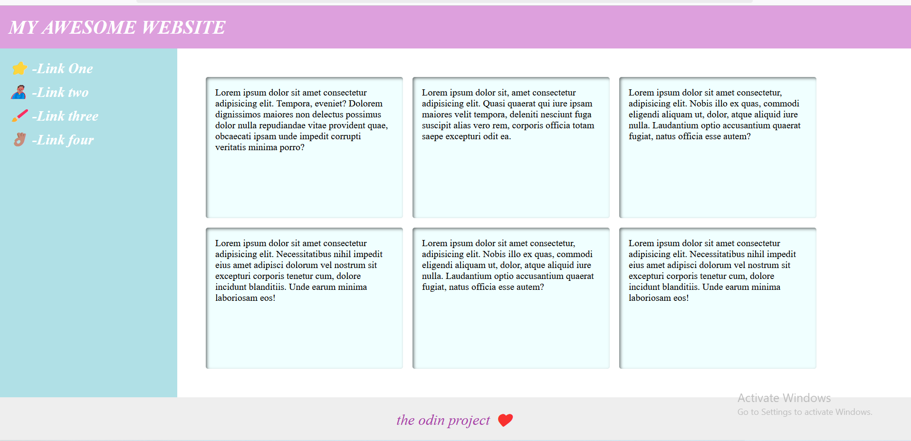

# Flexbox Exercise - The Holy Grail of Layout

This exercise implements a classic and highly common website layout using Flexbox, often referred to as the "Holy Grail" layout.

## ✅ Objectives

- Create a full-page layout using flexbox.
- Position the header at the top and the footer at the bottom of the viewport.
- Include a fixed-width sidebar and a flexible main content area.
- Align cards inside the main content area with wrapping behavior.
- Ensure layout responsiveness across different screen sizes.

## 🎯 Features

- Header with large, bold text aligned vertically.
- Fixed-width sidebar with navigation links.
- Main content area with card layout and responsive wrapping.
- Sticky footer aligned to the bottom of the page.
- Proper spacing and padding throughout layout.

## 💡 Notes

- Used `flex-direction: column` on the body to allow vertical stacking.
- Used `flex-wrap` on the cards container for responsive grid layout.
- Sidebar was prevented from shrinking using `flex-shrink: 0`.

